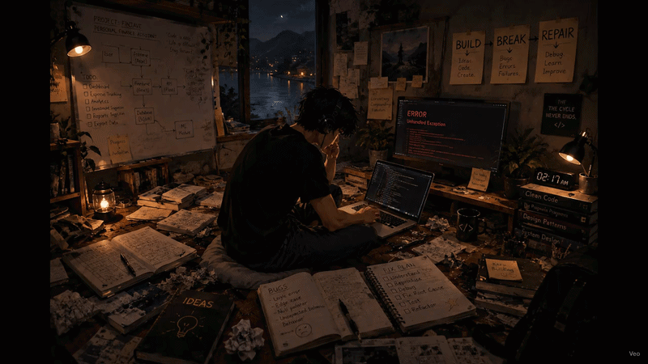

<div align="center">



<br>
<p align="center">
  
</p>

# ABINASH SHAJI

### `MCA STUDENT` • `DEVELOPER` • `PROBLEM SOLVER`

**BUILD. BREAK. REPAIR.**

*Always learning. Always building.*

<br>

[](https://www.linkedin.com/in/abinashshaji/)
[](https://github.com/AbinashShaji)
[](https://github.com/AbinashShaji)

</div>

---

## `> whoami`

I'm an **MCA student and developer** who enjoys turning ideas into working software.

I like the process as much as the result — learning a technology, experimenting with it, building something, breaking it, figuring out why it broke, and improving it.

Currently exploring **full-stack development, Python, Java, JavaScript, React, Flask, databases, cloud and DevOps**.

> **Build something → Break something → Understand it → Repair it → Build it better.**

---

## `> stack`

<div align="center">

### Languages


### Frontend


### Backend & Database


### Tools


</div>

---

## `> featured projects`

<table>
<tr>
<td width="50%">

### 💰 Finzave

A personal finance assistant focused on tracking expenses, analyzing spending patterns, understanding savings, and helping users make better financial decisions.

**Focus:** Python • Flask • SQLite • Analytics

</td>
<td width="50%">

### 🌐 Portfolio

My personal developer portfolio — focused on presenting my work, skills, experiments and projects through a modern interface.

**Focus:** JavaScript • React • Modern UI

</td>
</tr>

<tr>
<td width="50%">

### 🧪 Freelance

A collection of freelance/client-oriented work and experiments built while learning and applying modern web technologies.

**Focus:** JavaScript • Web Development

</td>
<td width="50%">

### 📈 Traid Future

A project exploring trading-related insights and future-oriented analysis.

**Focus:** TypeScript • Web Development

</td>
</tr>
</table>

---

## `> currently`

```text
🎓  MCA Student
💻  Building full-stack applications
🐍  Working with Python & Flask
⚛️  Exploring React & modern frontend development
☁️  Learning Cloud & DevOps
🧠  Improving problem solving & system design
🔧  Turning ideas into projects
```

---

## `> contribution game`

### 🐍 The Snake Eats My Contributions

<div align="center">

<!-- Generated automatically by .github/workflows/snake.yml -->


</div>

---

## `> github activity`

<div align="center">


</div>

<br>

<div align="center">


</div>

---

## `> contribution mindset`

<div align="center">

**BUILD** → **BREAK** → **REPAIR** → **LEARN** → **REPEAT**

</div>

---

## `> connect`

<div align="center">

<a href="https://github.com/AbinashShaji">

</a>

<a href="https://www.linkedin.com/in/abinashshaji/">

</a>

</div>

<br>

<div align="center">

### `Thanks for stopping by.`

**Always learning. Always building.**

</div>
