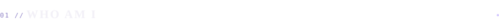
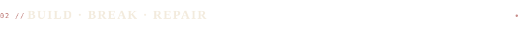
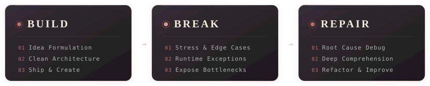
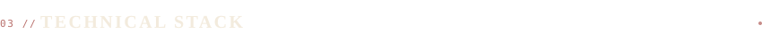
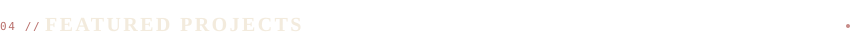
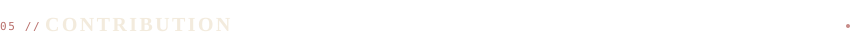
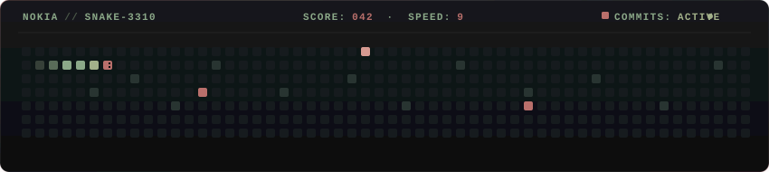
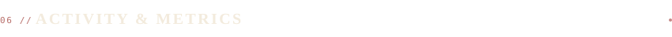
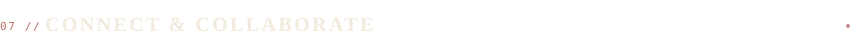

  

 

 

  

 

I'm an **MCA student and full-stack developer** driven by turning conceptual ideas into robust, resilient software.

I appreciate the entire engineering cycle as much as the finished product — learning a technology from fundamentals, building prototypes, diagnosing edge cases and failures, understanding root causes, and refactoring toward clean architecture.

Currently exploring **full-stack architecture, Python, Java, JavaScript, React, Flask, databases, cloud, and DevOps**.

> *“Build something → Break something → Understand it → Repair it → Build it better.”*

  

 

  

  

 

<table>
<tr>
<td width="50%" valign="top">

#### ◈ `LANGUAGES`
 

)

</td>
<td width="50%" valign="top">

#### ◈ `FRONTEND & ANIMATION`
 

</td>
</tr>
<tr>
<td width="50%" valign="top">

#### ◈ `BACKEND`
 

</td>
<td width="50%" valign="top">

#### ◈ `DATABASE & BACKEND SERVICES`
 

</td>
</tr>
<tr>
<td width="50%" valign="top">

#### ◈ `3D & VISUALIZATION`
 

</td>
<td width="50%" valign="top">

#### ◈ `TOOLS & CLOUD PLATFORMS`
 

</td>
</tr>
</table>

  

 

<table>
<tr>
<td width="50%" valign="top">

### ◈ Finzave
*Personal Finance Assistant*

A personal finance assistant focused on tracking expenses, analyzing spending patterns, understanding savings, and helping users make data-driven financial decisions.

`Python` · `Flask` · `SQLite` · `Analytics`

 

[View Architecture ↗](https://github.com/AbinashShaji)

</td>
<td width="50%" valign="top">

### ◈ Portfolio
*Developer Portfolio & Showcase*

Personal developer portfolio engineered with a modern component architecture to present technical experiments, projects, and background.

`React` · `JavaScript` · `Vite` · `Modern UI`

 

[Repository ↗](https://github.com/AbinashShaji/portfolio-2) &nbsp;·&nbsp; [Live Site ↗](https://portfolio-2-gilt-one.vercel.app)

</td>
</tr>
<tr>
<td width="50%" valign="top">

### ◈ Traid Future
*Market Insights & Future Analysis*

A web application exploring market insights, predictive data visualization, and financial data structures.

`TypeScript` · `React` · `Analytics`

 

[Repository ↗](https://github.com/AbinashShaji/Traid_future)

</td>
<td width="50%" valign="top">

### ◈ Freelance Work
*Client Solutions & Web Applications*

A curated collection of responsive web development projects, bespoke client applications, and frontend implementations.

`JavaScript` · `Web Development` · `UI/UX`

 

[Repository ↗](https://github.com/AbinashShaji/freelance-)

</td>
</tr>
</table>

  

 

<em>A little progress, one commit at a time.</em>

 

  

`commit → build → break → repair → repeat`

  

 

  

  

 

&nbsp;&nbsp;

&nbsp;&nbsp;

  

*“Quiet nights. Deep focus. Constantly refining.”*

